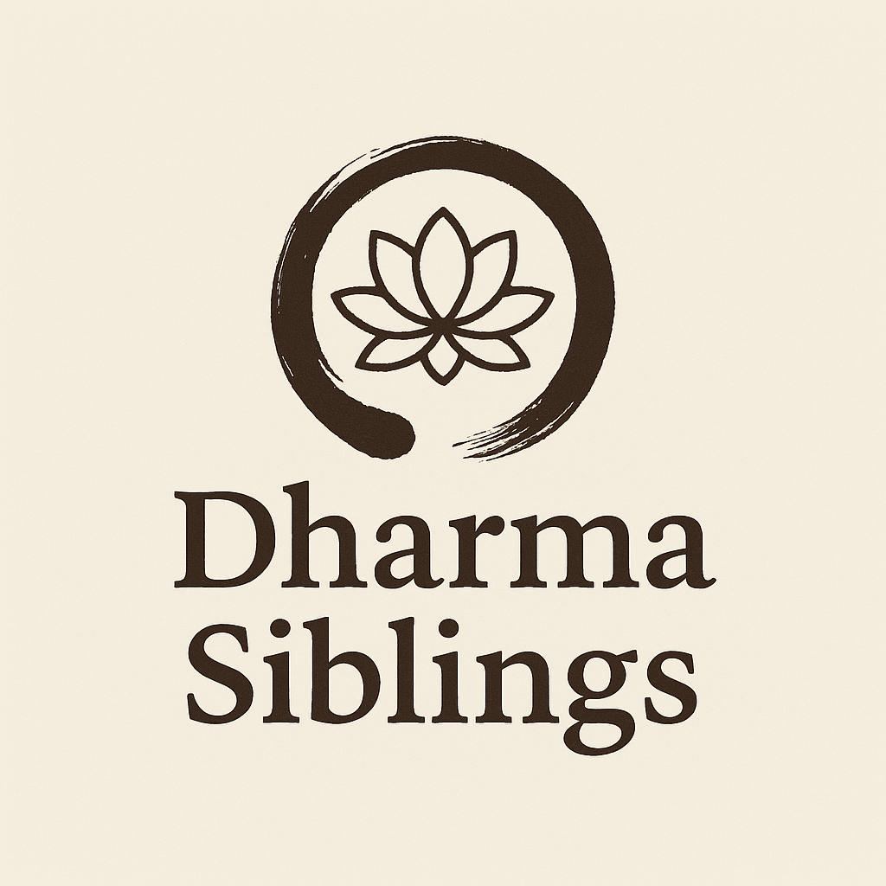

<!-- markdownlint-disable-file MD033 MD041 -->

  

# Dharma Siblings

---

## 📋 Project Status

---

## 🧭 About This Project

This site serves as a shared resource for the unofficial Houston Zen student group, *The Dharma Siblings*.
It hosts community guidelines, curated recommendations, and practice-related inspiration.

It is intended as an extension of our practice space—informal, evolving, and grounded in mutual respect and sincerity.

---

## 🔗 Site Sections

- [🪷 Liturgy](/pages/liturgy)
- [🎨 Artwork](/pages/artwork)
- [🎥 Video and Film](/pages/video-and-film)
- [📚 Literature](/pages/literature)
- [🥗 Recipes](/pages/recipes)

---

## 🕯️ How to Contribute

We welcome suggestions and contributions from group members.

### 🧶 Non-technical contributors

If you'd like to recommend a resource (book, video, artwork, etc.), or suggest a change to site content, you can:

- Contact **Erik** directly
- Post in the group chat
- Submit ideas during in-person meetings

We'll do our best to update the site accordingly.

### 👨‍💻 For those familiar with GitHub

- Fork this repository
- Create a branch for your edits
- Submit a pull request
- We’ll review and merge it when appropriate

Feel free to open issues for bugs, ideas, or questions.

---

## 📄 License

© 2025 *The Dharma Siblings*

This project is licensed under the
[Creative Commons Attribution-NonCommercial-ShareAlike 4.0 International License](https://creativecommons.org/licenses/by-nc-sa/4.0/).

You are welcome to share or adapt this material for your own practice group, as long as it:

- Is used for **non-commercial purposes**
- Includes **attribution**
- Is shared under the **same license**

---
